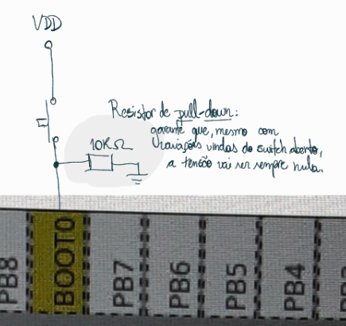
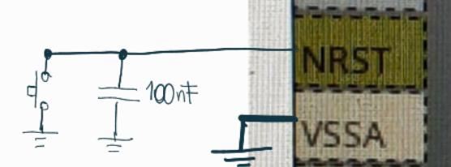
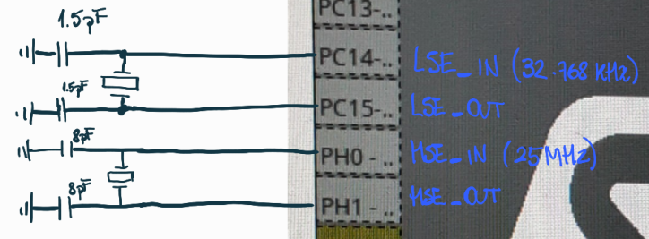
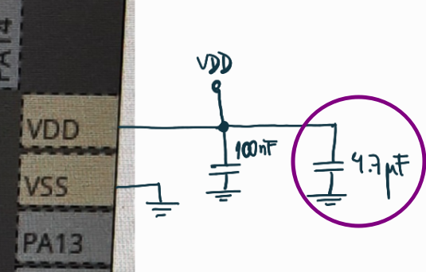
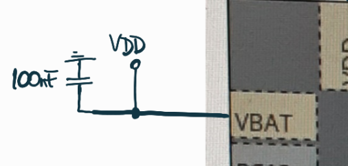
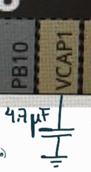
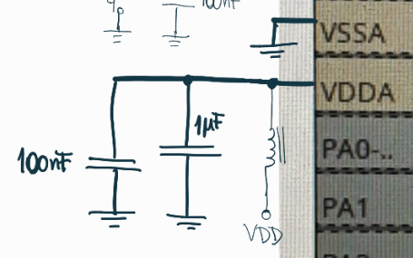

# BOOT0

| BOOT1 | BOOT0 | Mode              | Aliasing                                |
|-------|-------|-------------------|-----------------------------------------|
| X     | 0     | Main flash memory | Main Flash selected as boot space       |
| 0     | 1     | System memory     | System memory is selected as boot space |
| 1     | 1     | Embedded SRAM     | Embedded SRAM is selected as boot space |

Um resistor de pull-down de **10k&Omega;** garante que o nível de tensão seja 0 quando a chave esteja aberta.

# NRST

É ativado por **nível baixo no pino de NRST**. Colocar um capacitor de desacoplamento de **100nF** para proteger.

# Clock

- HSE: High Speed External. 32.768kHz. Caps de 1.5pF 
- LSE: Low Speed External. 25 MHz (na Blackpill da WeAct). Caps de 8pF.

Um oscilador de cristal ligado em paralelo com as linhas IN e OUT de cada um dos clocks (HSE e LSE), e caps de desacoplamento em cada linha, após o cristal, indo pro terra.

# Capacitores de desacoplamento

- Os pinos de **VDD** devem estar conectados a VDD com capacitores de desacoplamento externos:
  1. **1** de  **4.7&micro;F** (de Tântalo ou de cerâmica) para o pacote inteiro (vai em algum dos VDD);

        

  2. **1** de **100nF** (cerâmica) pra cada pino de VDD.

- Se nenhuma bateria externa for usada, conectar o **VBAT** a VDD, com um capacitor de desacoplamento de **100nF**.

    

- Adicionar 1 capacitor de **4.7&micro;F** a VCAP1.

    

- O pino de VDDA deve estar conectado a 2 capacitores de desacoplamento externos:
  1. **1** de **100nF** (cerâmica)
  2. **1** de **1&micro;F** (Tântalo ou cerâmica)

    
